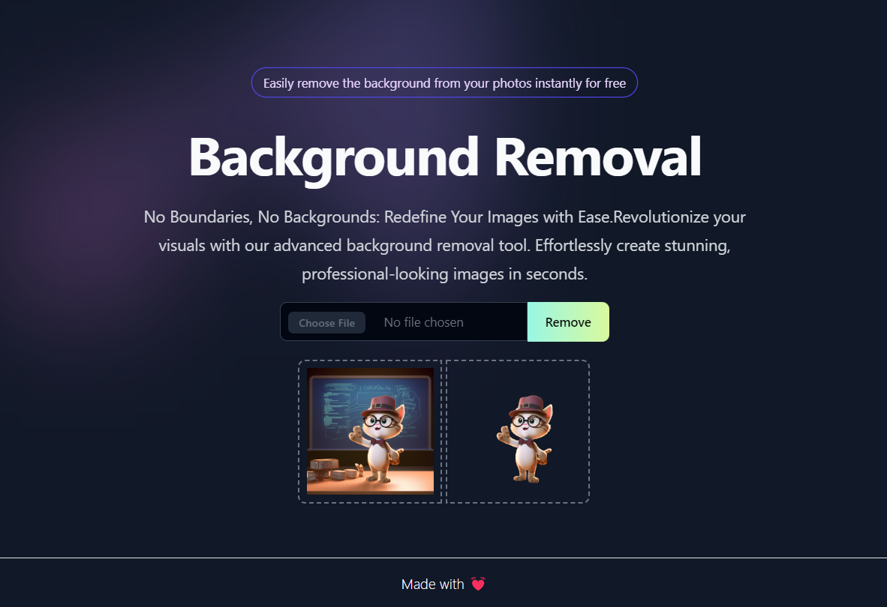

# PROJECT - BgRemove 🔗  

</a>


Project BgRemove is an online tool to remove background from images.

 With its intuitive and user-friendly interface, BgRemove provides a seamless space for individuals to remove background from the images for free.

 > Support, ⭐ the repository!

 



## Installation
To set up bgremove locally for development or testing purposes, follow these steps:

- Clone the repository: ```git clone https://github.com/Sugamgoel028/bgremove```
- Navigate to the project directory: ```cd bgremove```
- Install dependencies: ``` npm install ```
- Start the development server: ```npm run dev ```

## Folder Structure
```
bgremove/
├─ node_modules/
├─ public/
│  ├─ vite.svg 
│  ├─ screen.jpg 
│  ├─ react.png 
│  ├─ tailwindcss.png 
│  ├─ testimage.png 
│  ├─ testimagebgremoved.png 
├─ src/
│  ├─ components/
|  |   ├─ Footer.jsx
|  |   ├─ Hero.jsx
|  |   ├─ RemoveBackground.jsx
│  ├─ assets/
|  |   ├─ react.svg
│  ├─ App.jsx
│  ├─ main.jsx
│  ├─ App.css
│  ├─ index.css
├─ index.html
├─ .gitignore
├─ package.json
├─ package-lock.json
├─ postcss.config.js
├─ tailwind.config.js
├─ vite.config.js
├─ README.md
```

## Dependencies

|React|Tailwind CSS|Vitejs|
|:-:|:-:|:-:|
||||

 ## Contributing

Contributions are whole-heartedly welcomed! If you have any ideas for improvement or bug fixes, please open an issue or submit a pull request.⚡


> Support ⭐